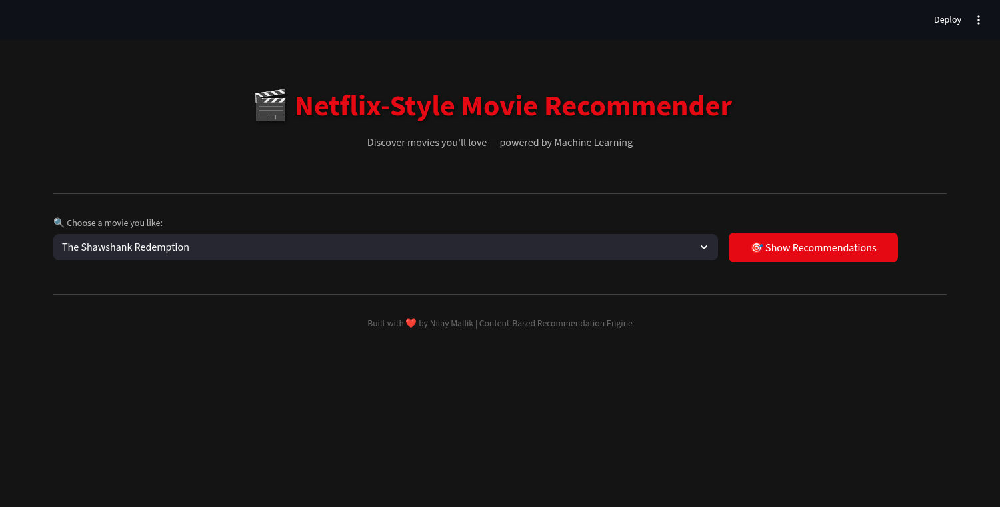
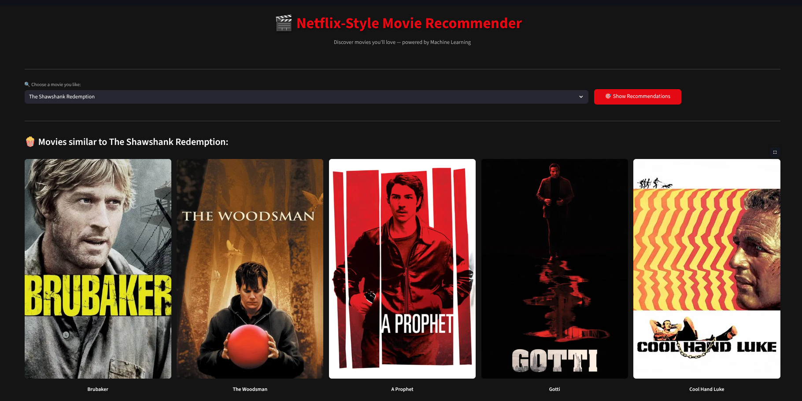
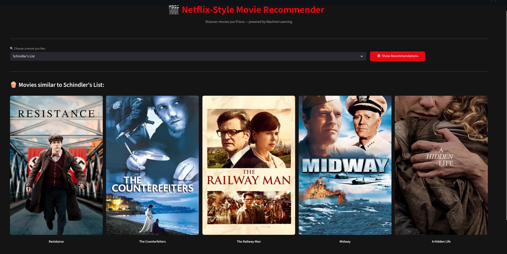

# Netflix-Style Movie Recommender System






A **content-based movie recommendation web application** that suggests similar movies based on a user's selected title. Built with Python, Scikit-learn, and Streamlit, featuring a sleek Netflix-inspired dark theme.

---

## Features

- **Interactive movie search** — Select from 10,000+ movies via dropdown
- **Smart recommendations** — Get top 5 similar movies using cosine similarity
- **Movie posters** — Dynamically fetched from the TMDB API
- **Netflix dark theme** — Custom CSS with animated card transitions
- **Fast performance** — Precomputed similarity matrix for instant results

---

## Tech Stack

| Component | Technology |
|-----------|-----------|
| Language | Python 3 |
| Web Framework | Streamlit |
| ML / NLP | Scikit-learn (CountVectorizer, Cosine Similarity) |
| Data Handling | Pandas, NumPy |
| API | TMDB (The Movie Database) |
| Serialization | Pickle |
| Notebook | Jupyter Notebook |

---

## How It Works

### 1. Data Preprocessing
- Load the TMDB 10K movies dataset (`movies.csv`)
- Select key columns: `id`, `title`, `overview`, `genre`
- Combine `overview` and `genre` into a single `tags` column
- Convert to lowercase for consistency

### 2. Text Vectorization
- Convert `tags` into numerical vectors using **CountVectorizer**
- Configuration: `max_features=10000`, `stop_words='english'`
- Produces a sparse bag-of-words matrix

### 3. Similarity Computation
- Calculate **cosine similarity** between all movie vectors
- Result: a 9985 × 9985 similarity matrix

### 4. Recommendation Engine
- User selects a movie → find its index in the matrix
- Retrieve similarity scores with all other movies
- Sort descending → return top 5 most similar titles

### 5. Poster Fetching
- Use TMDB API to fetch movie poster images by movie ID
- Built-in retry logic (3 attempts) with timeout handling

---

## Getting Started

### Prerequisites

- Python 3.8+
- pip (Python package manager)
- TMDB API key (included in the project)

### Installation

1. **Clone the repository**
   ```bash
   git clone https://github.com/nilaymallikk/Movie-Recommender-System
   cd <Movie Recommender>
   ```

2. **Install dependencies**
   ```bash
   pip install pandas scikit-learn requests streamlit
   ```

3. **Generate the model files** (if `movies.pkl` and `similarity.pkl` don't exist)

   Open `movie_recommender.ipynb` in Jupyter Notebook and run all cells

4. **Launch the app**
   ```bash
   streamlit run app.py
   ```
---

## Jupyter Notebook

The `movie_recommender.ipynb` notebook walks through the entire ML pipeline step by step:

| Section | Description |
|---------|-------------|
| 1 | Install & import libraries |
| 2 | Load & explore the dataset |
| 3 | Data preprocessing & feature engineering |
| 4 | Text vectorization with CountVectorizer |
| 5 | Cosine similarity matrix computation |
| 6 | Recommendation function & testing |
| 7 | TMDB API poster fetching |
| 8 | Save model with pickle |
| 9 | Streamlit app code (%%writefile) |
| 10 | Launch instructions |

---

## Dataset

- **Source:** TMDB 10K Movies Dataset
- **Size:** 10,000 movies
- **Columns used:** `id`, `title`, `overview`, `genre`
- **After cleaning:** 9,985 movies (15 dropped due to missing values)

---

## API Reference

This project uses the [TMDB API](https://www.themoviedb.org/documentation/api) to fetch movie poster images.

**Endpoint:**
```
GET https://api.themoviedb.org/3/movie/{movie_id}?api_key=YOUR_API_KEY&language=en-US
```

**Poster URL format:**
```
https://image.tmdb.org/t/p/w500{poster_path}
```

---
